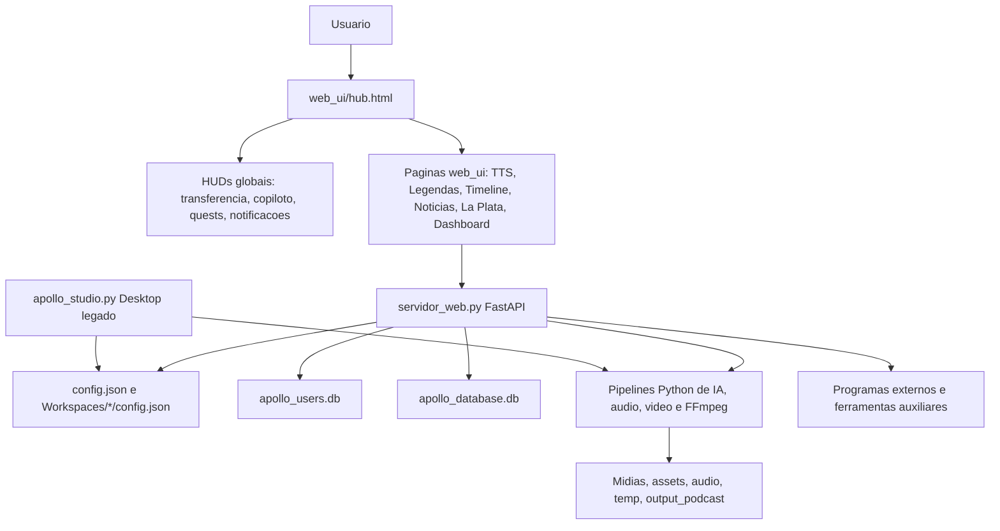

# Mapeamento Completo do Programa - Apollo Edit Web

Data do mapeamento: 2026-06-05

Este documento registra a leitura estrutural do projeto em `E:\MEUS PROGRAMAS\APOLLO_EDIT_WEB`.
Ele nao contem valores de chaves, tokens ou senhas. Quando uma chave foi encontrada no codigo/configuracao,
ela foi tratada apenas como risco operacional.

## 1. Resumo mental do sistema

O projeto e um ecossistema hibrido de producao audiovisual com tres camadas principais:

- **Apollo Edit Web**: interface web atual, servida por FastAPI em `servidor_web.py`, com hub em `web_ui/hub.html`.
- **Apollo Studio desktop legado**: aplicacao Tkinter/CustomTkinter em `apollo_studio.py` e varias abas `aba_*.py`.
- **Subprojetos externos La Plata / noticias / imagem**: apps estaticos, React/Vite, Flask e FastAPI auxiliares dentro de `Programas externos`, `Nova pasta`, `o_diretor_web` e `saas_backend`.

A direcao mais recente registrada nos documentos raiz e clara: o produto esta migrando do paradigma desktop/editor pesado para um SaaS/web/cloud baseado em workspace, APIs, HUDs, moedas/creditos, copiloto, central de noticias, ferramentas IA e renderizacao assistida.

## 2. Documentos raiz e intencao do produto

Arquivos raiz mais importantes para entender a intencao:

- `MEMORIA_ATIVA_SISTEMA.md`: confirma a virada para **Apollo Edit Web**, SaaS/web/cloud, uso de APIs, workspaces, moedas, HUD de transferencia/bagageiro, copiloto IA, swarm multiagente, notificacoes, quests, tour e SFX.
- `mapeamento_arquitetura.md`: descreve o fluxo multiagente: Atendente, Gerente, Analista/Fatiador, Swarm de mini-agentes, QA/Corretor de Congruencia e saida para Mapeador/Timeline.
- `PLANO_FASE_A_EDITOR_INTELIGENTE.md`: plano do editor inteligente legado, com foco em render FFmpeg, diretor IA, zoom/punch-in, legendas dinamicas, b-roll, cortes de silencio, ducking, LUFS, SFX, stress test e perfis.
- `PLANO_FASE_B_ECOSSISTEMA.md`: plano de ecossistema futuro: hotfolders, ponte com postador, AutoFlow Apollo, configs por canal, dashboard de custo de API, bridges ComfyUI/Pinokio, fila de geracao de midia, exportacao de projeto, LLM local e cache.
- `init_db.sql`: proposta de estrutura Supabase/Postgres com usuarios, wallets, garage, jobs e politicas RLS.

Leitura sintetica: o programa nao e apenas um editor. Ele tenta ser uma central de producao de canais, combinando roteiro, TTS, legendas, dublagem, montagem, noticias, pesquisa, geracao visual, fila, inventario e administracao de usuarios.

## 3. Inventario de pastas

### Nucleo vivo

- `servidor_web.py`: backend principal FastAPI.
- `web_ui/`: frontend atual servido como arquivos estaticos.
- `config_manager.py`: leitura, migracao e escrita de configuracoes.
- `user_database.py`: banco de usuarios, moedas, loja, visitas, ads e logs.
- `database_manager.py`: banco operacional de canais, renders, tokens e memoria ativa.
- `apollo_studio.py`: launcher e UI desktop legada.
- `aba_*.py`: modulos desktop por ferramenta/aba.
- `ai_director_pipeline.py`, `agencia_de_ia.py`, `gemini_api.py`, `tts_manager.py`, `audio_pipeline.py`, `render_timeline.py`: pipelines centrais de IA, midia e render.

### Workspaces e configuracoes por canal

- `Workspaces/DARK TRAP RADIO`
- `Workspaces/DESCARGA NEWS`
- `Workspaces/FILOSOFIA DO CODIGO`
- `Workspaces/FILOSOFIA DO CODIGO` com variante acentuada, aparentemente sem configuracao propria relevante
- `Workspaces/HISTORIAS DE 7 DIAS`
- `Workspaces/MACACO DRIVER`
- `Workspaces/OBSERVADOR ECONOMICO`
- `Workspaces/Tutorial das Coisas`

Cada workspace pode ter `config.json` proprio com personagens, provedores, caminhos, estetica, perfis de diretor e ajustes de canal.

### Midia, cache e saidas

- `assets/`, `audio/`, `imagem/`, `Midias/`, `output_podcast/`
- `cache_chats/`, `cache_mapeador.json`, `cache_edicao_basica.json`
- `temp/`, `temp_restore/`, `Teste_Stress_30Min/`
- `historico_renders.json`, `historico_tokens.json`, `render_status.json`, logs de erro e render.

### Artefatos pesados ou gerados

- `venv/`, `venv_sfx/`
- `dist/`, `build/`
- `__pycache__/`, arquivos `.pyc`
- `node_modules/` dentro de subprojetos
- zips e copias de backup

Esses itens nao devem ser tratados como fonte principal de arquitetura. Sao runtime, build, cache, backup ou dependencias instaladas.

## 4. Entrada e inicializacao

### Backend web

O ponto de entrada web e `servidor_web.py`.

Comportamento principal:

- cria um app FastAPI;
- inclui `admin_api.router`;
- serve `/` como `web_ui/hub.html`, ou traducao `web_ui/{lang}/hub.html` quando houver cookie de idioma;
- serve paginas HTML por `/{filename}.html`;
- monta `/temp`;
- monta `/ext_apps` apontando para `Programas externos`;
- monta `/ferramentas` apontando para uma pasta irma chamada `FERRAMENTAS`, quando existir;
- monta o restante de `/` como estatico de `web_ui`;
- expoe `start_server(workspace_name, workspace_path, port=8080)`, que ajusta workspace atual e roda Uvicorn em `127.0.0.1`.

### Desktop legado

`apollo_studio.py` tem dois papeis:

- `WorkspaceLauncher`: lista workspaces, cria/clona/edita canais e inicia o Studio com `--workspace`.
- `ApolloStudio`: UI desktop com abas importadas de `aba_*`.

Mesmo com a migracao web, o desktop ainda concentra muita logica de producao e serve como memoria tecnica do que o produto ja sabe fazer.

### Admin

Ha duas areas administrativas:

- rotas simples em `servidor_web.py` como `/admin`, `/api/admin/*`;
- router `admin_api.py`, montado em `/api/master/*`.

O admin usa token fixo em codigo no fluxo master. Isso precisa ser tratado como risco de seguranca.

## 5. Backend FastAPI

### Grupos de rotas principais

Rotas de pagina:

- `GET /`
- `GET /apollo-master`
- `GET /admin`
- `GET /admin_login`
- `GET /apollo-master/login`
- `GET /{filename}.html`

Autenticacao, usuario e economia:

- `POST /api/admin/login`
- `GET /api/admin/keys`
- `GET /api/admin/users`
- `POST /api/admin/users/credits`
- `POST /api/admin/users/create`
- `GET /api/user/profile`
- `POST /api/log_visit`
- `POST /api/rpg/buy_item`
- `POST /api/rpg/equip`

Workspace e configuracao:

- `GET /api/workspace`
- `GET /api/config/full`
- `POST /api/config/full`
- `GET /api/config/perfis_legenda`
- `GET /api/list_profiles`
- `GET /api/delete_profile`
- `POST /api/rename_profile`
- `POST /api/save_profile`
- `GET /api/load_profile`

Ferramentas de midia:

- `GET /api/browse_file`
- `GET /api/thumb`
- `GET /api/preview_image`
- `POST /api/ajustador/processar`
- `POST /api/volume/processar`
- `POST /api/ferramentas/processar`

TTS, narrador, legendas e dublagem:

- `GET /api/tts/personagens`
- `POST /api/tts/gerar`
- `POST /api/tts/testar_google`
- `POST /api/narrador/gerar`
- `POST /api/legendas/gerar`
- `POST /api/dublagem/diarizar`
- `POST /api/dublagem/processar`

Podcast e fabrica de clipes:

- `GET /api/podcast/dados`
- `POST /api/podcast/gerar`
- `GET /api/fabrica/templates`
- `POST /api/fabrica/carregar_musicas`
- `POST /api/fabrica/gerar_lote`
- `POST /api/fabrica/compilar`

Tanque, diretor e fila:

- `GET /api/tanque/lista`
- `POST /api/tanque/abrir`
- `GET /api/diretor/perfis_diretor`
- rotas de gerencia de perfis do diretor
- rotas `/api/fila/*`
- rotas `/api/montador/*`

Integracoes externas e noticias:

- `POST /api/externos/iniciar`
- `GET /api/externos/status`
- `POST /api/laplata/generate`
- `POST /api/grok`
- `GET /api/grok/models`
- `POST /api/noticias/ai`
- `GET /api/proxy-image`
- `GET /api/search-youtube`
- `GET /api/search-images`
- `POST /api/s3/presigned`

### Duplicidades e conflitos

Foram detectadas duplicidades de rota:

- `/api/chat` tem duas definicoes.
- `/api/tts/gerar` tem duas definicoes.

Em FastAPI isso tende a criar comportamento confuso: a primeira ou ultima funcao pode acabar sendo usada dependendo de ordem e registro, e a manutencao fica perigosa.

### Rotas chamadas pelo frontend que parecem faltar

O frontend referencia algumas APIs que nao apareceram no backend principal:

- `/api/public/ads`
- `/api/render_diretor`
- `/api/config/personagens`
- `/api/download-zip`
- `/api/export_timeline`
- `/api/ai_edit_timeline`
- `/api/render_status`
- `/api/generate_broll`
- `/api/chat_copilot`
- `/api/check_inbox`

Isso indica que parte do frontend foi portada de outro app ou ficou a frente do backend.

## 6. Bancos de dados

### `apollo_users.db`

Gerenciado por `user_database.py`.

Tabelas detectadas:

- `users`
- `transactions`
- `system_settings`
- `api_usage_logs`
- `ad_campaigns`
- `render_logs`
- `support_messages`
- `page_visits`
- `store_items`
- `user_inventory`
- `user_equipped`

Responsabilidades:

- usuarios;
- roles/planos;
- creditos, gas, cristais;
- loja e inventario;
- visitas;
- campanhas de anuncio;
- logs de uso e render.

Risco: hash de senha com SHA-256 simples, sem salt/bcrypt/argon2.

### `apollo_database.db`

Gerenciado por `database_manager.py`.

Tabelas detectadas:

- `canais`
- `historico_videos`
- `historico_tokens`
- `memoria_ativa`

Responsabilidades:

- registrar canais;
- registrar jobs/videos;
- atualizar status de render;
- registrar uso de API;
- armazenar memoria ativa por chave/canal.

### `saas_backend/database.db`

Banco menor do backend SaaS legado.

Tabelas:

- `users`
- `hwids`

Responsabilidades:

- login simples;
- vinculo por hardware ID;
- webhook Kiwify.

### `init_db.sql`

Nao e usado diretamente pelo FastAPI atual, mas representa a direcao Supabase/Postgres:

- `users`;
- `wallets`;
- `garage`;
- `jobs`;
- RLS policies.

## 7. Configuracoes

### `config.json`

Configuracao raiz com:

- `app_info`
- `personagens`
- `backgrounds`
- `paths`
- `subtitles`
- `capa`
- `api_config`
- `admin_config`
- `vps_config`
- `music_factory`
- `shortcuts`
- `perfis_diretor`

Provedores detectados no modelo de configuracao:

- VoiceMaker
- Gemini
- ChatGPT/OpenAI
- OpenRouter
- Grok/xAI
- Apify
- Brave
- ComfyUI
- Pexels
- Pixabay

Risco critico: ha segredos reais em texto puro no arquivo raiz e em partes de subprojetos. Eles devem ser rotacionados, removidos do repositorio/pasta compartilhada e substituidos por variaveis de ambiente ou cofre local.

### `config_manager.py`

Funcoes principais:

- cria configuracao padrao;
- carrega e salva JSON;
- migra estrutura antiga;
- resolve caminhos;
- acessa personagens, backgrounds e APIs;
- resolve FFmpeg e FFprobe.

Atencao: o padrao singleton pode causar confusao se o codigo tentar inicializar `ConfigManager` com arquivos diferentes no mesmo processo.

## 8. Frontend web_ui

### Hub

`web_ui/hub.html` e a primeira tela do Apollo Edit Web.

Ele agrega:

- seletor de idioma;
- painel de usuario, creditos e cristais;
- workspaces/canais;
- inventario/garagem;
- ferramentas;
- timeline;
- central de noticias;
- TTS, dublagem, narrador e legendas;
- La Plata;
- mercado;
- node studio;
- fila;
- dashboard;
- configuracoes.

Problemas detectados:

- scripts repetidos no proprio HTML, incluindo `i18n_loader.js`, `auth.js`, `bg_parallax.js`, `racer_loading.js`, `transfer_hud.js` e `laplata_ai.js`;
- referencias para `chat_client.js` e `laplata_inventory.js`, que nao foram encontrados em `web_ui`;
- mistura de sistemas: Supabase placeholder, SQLite backend, mocks em localStorage e APIs internas.

### Scripts globais

- `auth.js`: tenta conectar Supabase com placeholders, busca `/api/user/profile`, aplica moedas, avatar, ranks, permissoes, acesso a paginas, ads e mock de canais/localStorage.
- `transfer_hud.js`: HUD global de transferencia e bagageiro. Usa localStorage `apollo_transfer_v3`, suporta copiar, cortar, colar, desfazer, upload S3, drag/drop, download, pastas e abas.
- `copilot_hud.js`: copiloto flutuante com chat, acoes rapidas e sensores de contexto. Parte ainda e placeholder/local.
- `apollo_notifications.js`: notificacoes globais.
- `apollo_quests.js`: missoes/quests locais e integracao com moeda/inventario.
- `apollo_sfx.js`: sons WebAudio para cliques, sucesso, erro e drop.
- `apollo_tour.js`: tour guiado, salvo em localStorage.
- `i18n_loader.js`: idioma e seletor.
- `racer_loading.js`: loading tematico.
- `video_ad_modal.js`: modal de anuncio.

### Paginas web principais

- `admin.html`: dashboard admin.
- `apollo-master/index.html`: area master separada.
- `chat_ia.html`: chat IA.
- `config.html`: configuracoes.
- `dashboard.html`: estatisticas.
- `diretor.html`: diretor IA.
- `dublagem.html`: dublagem.
- `ferramentas.html`: ferramentas FFmpeg/midia.
- `fila.html`: fila de render.
- `garagem.html`: inventario.
- `legendas.html`: legendas.
- `login.html`: login.
- `mercado.html`: loja/economia.
- `midia.html`: midia.
- `montador.html`: montador.
- `musica.html`: fabrica musical.
- `narrador.html`: narrador.
- `oficina.html`: oficina.
- `perfil.html`: perfil.
- `podcast.html`: podcast.
- `tanque.html`: tanque de midia.
- `timeline.html`: editor/timeline.
- `tts.html`: TTS.
- `volume.html`: processamento de volume.

### Timeline

`web_ui/timeline.js` e um dos maiores scripts do frontend.

Ele cobre:

- tracks/clipes;
- split/razor;
- drag/drop;
- playback;
- inspector;
- perfis;
- render/polling;
- geracao de b-roll;
- copiloto;
- inbox;
- exportacao de timeline.

Boa parte da timeline chama endpoints que parecem faltar no backend atual, o que indica uma area importante para reconciliacao.

### Central de Noticias

Ha duas fases:

- `noticias.html` antigo, com `noticias_core.js`;
- paginas modulares novas: dashboard, channel, history, images, miner, monitor, news, radar, scripts, settings, strategy, studio, timeline, analytics.

Arquivos-chave:

- `noticias_nav.js`: navegacao, body builder, toast e prefill.
- `*_logic.js`: logica de cada pagina.

Contratos usados:

- `/api/noticias/ai`
- `/api/search-youtube`
- `/api/search-images`
- localStorage para chaves, perfis, historico e videos salvos.

## 9. Pipelines Python principais

### Edicao e render

- `aba_dark_facil.py`: nucleo pesado do editor/render legado. Usa FFmpeg, Vosk/Whisper/faster-whisper, gera mapeamento, ASS, timeline e render.
- `render_timeline.py`: montagem de timeline FFmpeg.
- `media_adjuster.py`: presets, dimensoes, duracao e comandos FFmpeg.
- `audio_pipeline.py`: corte de silencio, LUFS, filtros e normalizacao.
- `audio_processor.py`: enhancement/mastering com imports tardios.

### IA e agentes

- `ai_director_pipeline.py`: diretor IA com Gemini/OpenAI/OpenRouter/Grok, contexto de canal, tags de pasta, heuristicas fallback e registro de tokens.
- `agencia_de_ia.py`: orquestracao multiagente inspirada no plano de arquitetura.
- `ai_editor_copilot.py`: descoberta local de midia e copiloto de edicao.
- `ai_asset_indexer.py`: indexacao/tagueamento de assets.
- `chat_ai_manager.py`: historico persistente de chats por canal.

### TTS, voz, narrador e dublagem

- `tts_manager.py`: dispatch de provedores TTS e controle de bloqueios.
- `gemini_tts_api.py`: TTS Gemini e SRT via Whisper.
- `voicemaker_api.py`: VoiceMaker e simulacao.
- `openaifm_api.py`: automacao Selenium para OpenAI.fm e controle Proton VPN.
- `diarization_engine.py`: diarizacao com pyannote e recorte/recomposicao.
- `video_rvc_processor.py`: extracao de audio, separacao vocal, RVC, mixagem/substituicao.

### Ferramentas de conteudo

- `gerador_podcast.py`: parsing de roteiro/tags, segmentos de video, compressao, normalizacao e concat.
- `music_video_engine.py`: geracao e compilacao de clipes musicais.
- `aba_fabrica_clipes.py`: UI desktop da fabrica musical.
- `aba_mapeador_automatico.py`: mapeamento texto/midia.
- `aba_legendas.py`: gerador de legendas.
- `aba_podcast.py`, `aba_narrador.py`, `aba_tts.py`, `aba_ferramentas.py`, `aba_configuracoes.py`: interfaces desktop legadas.

## 10. Workspaces

### `DARK TRAP RADIO`

Configuracao simples, principalmente cores/tema.

### `DESCARGA NEWS`

Workspace rico em personagens e personas jornalisticas/humoristicas. Contem muitos apresentadores/personagens e provedores ChatGPT/OpenRouter/Grok.

### `FILOSOFIA DO CODIGO`

Configuracao com VPS, APIs, fabrica de musica, atalhos e perfis do diretor. Representa canal com producao mais tecnica/filosofica.

### `HISTORIAS DE 7 DIAS`

Personagens como Darius/Hugo/Joye/Elph, caminhos de outputs/temp/assets e provedores de IA.

### `MACACO DRIVER`

Personagem `Apresentador Macaco`, backgrounds padrao/noticias/urgente, provedores Gemini/ChatGPT/OpenRouter/Grok/Brave/HuggingFace e configs de video/audio.

### `OBSERVADOR ECONOMICO`

Configuracao praticamente vazia.

### `Tutorial das Coisas`

Workspace bem configurado, com personagens, estetica do canal, diretor IA, perfis de legenda, perfis de personagem e ultimos diretorios.

## 11. Subprojetos externos

### `Programas externos/APOLLO La PLATA Ferramentas`

App estatico com:

- `index.html`;
- `styles.css`;
- `script.js`.

Ferramentas:

- Gerador de Prompt;
- Gerador de Hashtag;
- Descrever Imagem;
- Mineracao Viral;
- Gerador de Titulos;
- Gerador de Descricoes;
- Gerador de Imagens;
- Analisador de Tendencias;
- Gerador VEO3/FLOW;
- Gerador de Roteiros;
- Otimizador de Conteudo;
- Gerador de Roteiro Visual.

Integra APIs diretamente do browser. Risco critico: chaves em texto puro no JS.

### `Programas externos/central-das-noticias`

App React/Vite/Express. Parece uma versao anterior ou paralela da Central de Noticias depois migrada para `web_ui`.

Tecnologias:

- React;
- Vite;
- Express;
- TypeScript;
- `@google/genai`;
- `better-sqlite3`;
- `lucide-react`;
- `motion`;
- `react-markdown`;
- `recharts`;
- `yt-search`;
- `jszip`;
- `file-saver`.

### `Nova pasta`

Outra copia/fonte da Central de Noticias React.

Tem:

- `server.ts` com busca/proxy/APIs;
- `src/App.tsx` grande;
- libs para Gemini, Grok, OpenRouter, Apify e webhooks;
- componentes de dashboard, historico, imagens, integracoes, monitor, canal, radar, scripts, settings e estrategia.

### `Programas externos/gerador-de-historias-por-imagem---apollo-la-plata`

App React/Vite com Express proxy.

Funcionalidades detectadas:

- Gemini Character Studio;
- projetos/personagens/settings/gallery/jobs;
- workflows ComfyUI local/cloud;
- OpenRouter, OpenAI, Grok/xAI;
- Apify scrape;
- rotacao de chaves;
- IndexedDB `GeminiStudioDB`;
- social posts, thumbnails, diretor de video, carrossel e sala de roteiro.

### `o_diretor_web`

App Flask legado.

Rotas para:

- audio;
- video narrador;
- montagem de bloco;
- diretor render;
- criador de templates;
- editor de video;
- transicoes;
- volume;
- finalizacao;
- ferramentas;
- montagem automatica;
- clipe musical;
- legendas;
- podcast;
- ajustador de midia;
- dublagem RVC;
- configuracoes;
- browse/serve file.

Serve como prototipo historico de varios modulos hoje espalhados no FastAPI e no frontend.

### `saas_backend`

FastAPI pequeno de login/licenciamento.

Rotas:

- `/login`;
- `/webhook/kiwify`.

Usa banco `database.db` com usuarios e HWIDs. Parece legado ou prototipo para controle de acesso/pagamento.

### `elevenlabs-examples-main`

Repositorio vendorizado de exemplos ElevenLabs. Nao parece nucleo do Apollo; e referencia/dependencia externa copiada.

## 12. Contratos e dependencias

### Frontend -> Backend

O frontend chama cerca de duas centenas de ocorrencias `/api/...`, com contratos principais para:

- usuario/perfil/economia;
- logs de visita;
- configuracao;
- TTS;
- narrador;
- legendas;
- dublagem;
- podcast;
- fabrica musical;
- montador;
- diretor;
- fila;
- noticias;
- busca de imagens/videos;
- S3 presigned upload;
- timeline/render.

O maior problema atual e a divergencia entre chamadas do frontend e rotas disponiveis.

### Backend -> Provedores externos

Provedores citados/implementados:

- Gemini;
- OpenAI/ChatGPT;
- OpenRouter;
- Grok/xAI;
- VoiceMaker;
- OpenAI.fm via automacao;
- Google TTS/testes;
- Brave;
- Apify;
- Pexels;
- Pixabay;
- ComfyUI;
- HuggingFace em alguns configs;
- pyannote/Whisper/Vosk/faster-whisper;
- FFmpeg/FFprobe.

## 13. Riscos tecnicos prioritarios

1. **Segredos em texto puro**

   Existem chaves reais em `config.json` e em scripts de subprojetos. Acao recomendada: rotacionar, mover para `.env`/cofre, remover de arquivos versionaveis/compartilhados e criar um carregador seguro.

2. **Sem repositorio Git detectado**

   `git status` indicou que a pasta nao e um repositorio. Sem Git, fica dificil proteger refactors, comparar alteracoes e reverter acidentes seletivamente.

3. **Rotas duplicadas**

   `/api/chat` e `/api/tts/gerar` precisam ser unificadas.

4. **Frontend chama APIs ausentes**

   Timeline, ads, diretor e inbox precisam de reconciliacao de contrato.

5. **Hub carrega scripts duplicados e inexistentes**

   Isso pode gerar execucao duplicada, estado duplicado, bugs de inicializacao e erros 404.

6. **Autenticacao misturada**

   Ha Supabase placeholder, SQLite local, token master fixo, mocks em localStorage e permissoes no frontend.

7. **Senha com hash fraco**

   `user_database.py` usa SHA-256 simples. Migrar para bcrypt/argon2.

8. **Muitos legados convivendo**

   Desktop Tkinter, Flask, React antigo, FastAPI atual e apps estaticos dividem conceitos sem uma fonte unica.

9. **Config singleton com risco de estado errado**

   `ConfigManager` singleton pode reutilizar arquivo de config anterior dentro do mesmo processo.

10. **Encoding e copias**

   Ha indicios de arquivos legados com encoding diferente e muitas copias/builds/backups, o que aumenta o risco de editar o arquivo errado.

## 14. Ordem sugerida de estabilizacao

1. **Higiene de seguranca**

   Rotacionar segredos, remover chaves dos JS/configs, criar `.env.example` sem valores e mover leitura de provedores para backend.

2. **Transformar pasta em repo controlado**

   Inicializar Git ou mover fonte viva para repo limpo. Criar `.gitignore` para venv, node_modules, dist, build, temp, cache, pyc, bancos locais e midias pesadas.

3. **Mapa de contrato API**

   Criar lista formal de endpoints esperados pelo frontend e implementados pelo backend. Corrigir ou remover chamadas ausentes.

4. **Limpar `hub.html`**

   Remover scripts duplicados, corrigir scripts inexistentes, deixar ordem de bootstrap unica.

5. **Escolher fonte da Central de Noticias**

   Decidir se a fonte viva e `web_ui/noticias_*` ou React em `Nova pasta`/`Programas externos/central-das-noticias`.

6. **Unificar autenticacao/economia**

   Definir uma origem de verdade: SQLite local, Supabase ou outro backend. Depois mover permissoes sensiveis para o servidor.

7. **Consolidar render/timeline**

   Implementar ou remover contratos ausentes: render diretor, export timeline, render status, b-roll, chat copiloto e inbox.

8. **Separar legado de produto vivo**

   Arquivar `o_diretor_web`, copias, zips e apps de referencia em uma area marcada como legado, mantendo links no mapa.

## 15. Leitura por modulo em uma frase

- `servidor_web.py`: cola central entre UI web, configs, bancos e pipelines Python.
- `web_ui/hub.html`: porta de entrada e painel de navegacao do produto web.
- `transfer_hud.js`: area de transferencia/bagageiro do ecossistema.
- `auth.js`: mistura atual de perfil, permissoes, moedas, Supabase placeholder e mock local.
- `timeline.js`: tentativa de editor web completo, ainda nao totalmente casada com o backend.
- `noticias_*`: Central de Noticias modular vanilla, provavelmente substituindo o app React antigo.
- `apollo_studio.py`: desktop legado e launcher de workspaces.
- `aba_dark_facil.py`: motor legado mais pesado de edicao/render.
- `ai_director_pipeline.py`: cerebro de diretor IA por canal.
- `agencia_de_ia.py`: esqueleto de orquestracao multiagente.
- `database_manager.py`: historico operacional de canal/render/tokens/memoria.
- `user_database.py`: usuarios, moedas, loja, ads e logs.
- `config_manager.py`: configuracao, migracao, caminhos e provedores.

## 16. Conclusao

O Apollo Edit Web ja tem muita coisa construida, mas ainda esta em fase de convergencia. A parte mais forte e a acumulacao de capacidades: TTS, legenda, dublagem, diretor IA, noticias, timeline, montador, podcast, musica, inventario, workspaces e economia. A parte mais fragil e a costura: seguranca de chaves, contrato frontend/backend, duplicidade de legados e fonte unica de autenticacao.

O caminho mais seguro e tratar este mapa como base para uma fase de estabilizacao: primeiro proteger segredos, depois limpar o hub, reconciliar APIs, definir o backend de identidade/economia e so entao evoluir a experiencia visual.

---
## [MAPEAMENTO DA API CENTRAL DE INFERÊNCIA (LIGHTNING AI)] (Data: 08/06/2026)

**A GRANDE DESCOBERTA:** 
Não precisamos criar dezenas de "Agentes" isolados no painel da Lightning e capturar URLs diferentes. A Lightning AI provê uma **API Universal Padrão OpenAI**. 
Com uma única Chave de API, podemos chamar *QUALQUER* modelo trocando apenas a string do parâmetro model.

**Endpoint Universal:** https://lightning.ai/api/v1/chat/completions
**Formato:** Idêntico à API da OpenAI (Permite usar a biblioteca oficial openai do Python/Node).

### Exemplos de Chamada de Produção (Guardados para o Apollo):

**Python (Biblioteca OpenAI Oficial):**
`python
from openai import OpenAI
client = OpenAI(
    base_url="https://lightning.ai/api/v1/",
    api_key="SUA_CHAVE_AQUI",
)
completion = client.chat.completions.create(
    model="openai/gpt-5", # AQUI TROCAMOS O MODELO DINAMICAMENTE
    messages=[{"role": "user", "content": "Hello, world!"}]
)
print(completion.choices[0].message.content)
`

**JavaScript (Fetch puro - Útil para painéis leves):**
`javascript
fetch("https://lightning.ai/api/v1/chat/completions", {
  method: "POST",
  headers: {
    "Authorization": "Bearer SUA_CHAVE_AQUI",
    "Content-Type": "application/json",
  },
  body: JSON.stringify({
    model: "openai/gpt-5", // TROCA-SE O MODELO AQUI
    messages: [{ role: "user", content: "Hello, world" }]
  }),
});
`

### TABELA DE MODELOS E CUSTOS (Referência para o Banco de Dados)
*(Nota: Valores parecem ser USD por 1 Milhão de Tokens - Input / Output)*

| Modelo | Provedor | Custo (In/Out) | Contexto |
| :--- | :--- | :--- | :--- |
| **nvidia-nemotron-3-ultra-550b-a55b** | Nvidia / Lightning | **.00 / .00** (GRATUITO/ZERO) | - |
| GPT 4 | OpenAI | .00 / .00 | 8K |
| GPT 4 Turbo | OpenAI | .00 / .00 | 128K |
| GPT 4o | OpenAI | .50 / .00 | 128K |
| GPT 5 | OpenAI | .25 / .00 | 400K |
| GPT 5.2 | OpenAI | .75 / .00 | 400K |
| GPT 5.4 | OpenAI | .50 / .00 | 1M |
| GPT 5.5 | OpenAI | .00 / .00 | 1M |
| Claude Opus 4 | Anthropic | .00 / .00 | 200K |
| Claude Opus 4.1 | Anthropic | .00 / .00 | 200K |
| Claude Opus 4.5 | Anthropic | .00 / .00 | 200K |
| Claude Opus 4.6 | Anthropic | .00 / .00 | 200K |
| Claude Opus 4.7 | Anthropic | .00 / .00 | 1M |
| Claude Opus 4.8 | Anthropic | .00 / .00 | 1M |
| Claude Sonnet 4 | Anthropic | .00 / .00 | 200K |
| Claude Sonnet 4.5 | Anthropic | .00 / .00 | 200K |
| Claude Sonnet 4.6 | Anthropic | .00 / .00 | 200K |
| Gemini 3.1 Pro | Google | .00 / .00 | 1M |

---

---

## 6. A ARQUITETURA DEFINITIVA DOS AGENTES (PONTO DE VISTA DO USUÁRIO)
*(Correção e Refinamento de UX - Data: 08/06/2026)*

Para não haver confusão, o sistema de IA para o usuário final é dividido em três entidades distintas e geniais:

### A. O Copiloto Personalizado (Roteirista Customizado do Cliente)
O usuário tem a liberdade de criar o seu próprio "Funcionário IA".
- **Aba de Criação:** Ele dá nome, foto, descreve a personalidade, o canal do YouTube, as funções exatas e habilidades especiais (Ex: "Especialista em criar roteiros de suspense").
- **Escolha do Cérebro:** O próprio usuário escolhe na lista qual Modelo de IA vai pilotar esse boneco (Ex: "Eu quero o GPT 3.5 Turbo pro meu roteirista").
- **Uso na Esteira:** Quando o usuário vai para a "Geração de Vídeo Automatizado", ele seleciona o "seu" bonequinho roteirista. O custo desse bonequinho trabalhar é pago pelo usuário usando os quadradinhos mágicos (Cristais), atrelado ao custo do modelo que ele mesmo escolheu.

### B. O Playground de IA (O "ChatGPT/Gemini" Interno do Apollo)
Uma aba dedicada exclusivamente para o usuário conversar livremente com IAs.
- Ele seleciona o modelo que quiser (Claude, GPT, Gemini).
- Custo pago por input usando a "Gasolina" (fracionamento em centavos baseados no modelo escolhido).
- **Recurso de Projetos:** Inspirado no Gemini, ele pode criar pastas/projetos e atrelar agentes com conhecimentos específicos para ajudar a escrever textos, organizar ideias, antes de mandar para a linha de produção de vídeos.

### C. O Agente de Suporte Central (O Fantasma Omnipresente do Apollo)
Este é o robô da plataforma (não o roteirista do cliente).
- Ele atende o cliente no WhatsApp, fica flutuando na interface do site e tira dúvidas.
- Sabe tudo sobre o cliente.
- Se o cliente estiver na aba de criação, esse robô de suporte pode ajudar, mas sua função principal é guiar e vender (Gerar orçamentos, receitas, direcionamentos).

Esta estrutura cria um ecossistema viciante onde o usuário se sente dono de uma agência de publicidade particular (com seus próprios roteiristas customizados) e paga alegremente a gasolina e os cristais para manter sua agência rodando.

## 7. ARQUITETURA DEFINITIVA DE GERAÇÃO DE IMAGENS (FLUX MULTI-PASS / TEXT-LOCKING)
*(Registro de Ouro - 10/07/2026)*

**A LÓGICA DE INJEÇÃO (NÃO ALTERAR):**
O processo que insere múltiplos personagens (ex: 3 pessoas) em uma única imagem foi otimizado para a nuvem Modal. A única forma aceitável e rápida (~2.5 minutos) de executá-lo é através do motor nativo:

1. **Script de Orquestração:** ackend/tests/test_multipass_direct.py
2. **Método de Execução:** Execução via RPC Direta (modal run test_multipass_direct.py). NUNCA usar requisições autônomas via roteador HTTP (
equests.post), pois isso força reinicializações a frio duplas no servidor da Modal, explodindo o tempo para quase 9 minutos.
3. **Workflows ComfyUI (Os arquivos Intocáveis):**
   - **Geração Base:** pollo_flux2_klein.json (Gera o cenário sem personagens).
   - **Geração Inpaint (Multi-pass):** 10resultado_3_personagens_CHAINED_klein.json. Este arquivo roda repetidas vezes (loop nativo no python) inserindo um personagem por vez sobre a mesma imagem usando ReferenceLatent.
4. **O Segredo do Text-Locking:** O segredo para que os rostos não se fundam (Efeito Quimera) nem gerem pessoas aleatórias não é usar PuLID nem Máscaras Regionais. A solução é a redundância textual. O LLM deve receber **descrições fotorealistas idênticas às fotos** (cabelo, barba, cor de roupa, expressão). Se o prompt de texto for genérico (ex: 'Person 1, a man'), o modelo ignora a foto e desenha um estranho. Prompts maciços e descritivos *travam* a identidade na referência da imagem.
