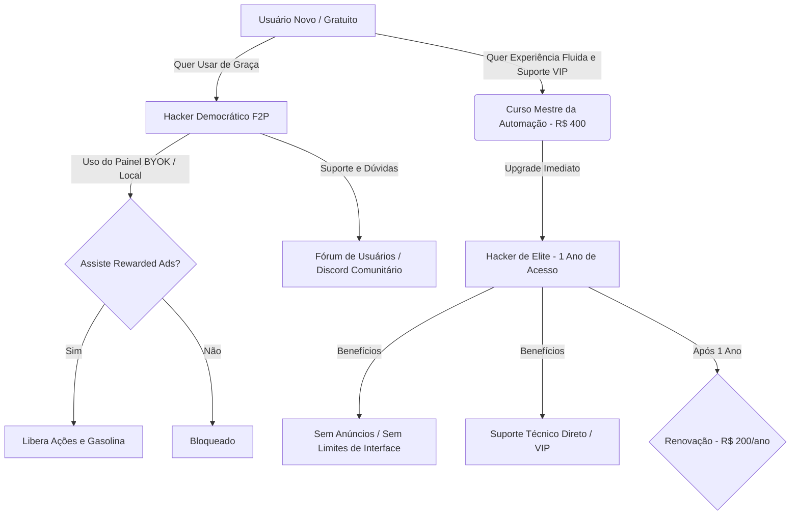

# 💰 Apollo Edit - Sistema Econômico e Monetização (Misto Perfeito: Visão 1 + Visão 3)

Este documento salva permanentemente todas as mecânicas financeiras, garantindo que nenhum detalhe seja perdido, mesmo que o chat seja reiniciado.

## 1. O Triângulo das Moedas
A plataforma possui três pilares financeiros:
*   **⛽ Gasolina (Tempo Render / Soft Currency Básica):** É a "stamina". Usada puramente para acionar o poder do nosso servidor (ex: FFmpeg). Pode ser obtida assistindo propagandas (Ads) ou comprada em massa.
*   **🪙 Apollo Coins (Soft Currency Secundária):** Moeda de "grind". Ganhamos na Roleta Diária, cumprindo missões ou por login diário. Serve para comprar itens estéticos básicos ou poções.
*   **💎 Cristais (Hard Currency):** Moeda comprada com dinheiro real. O ativo mais valioso. Usado para automação pesada (Full-Auto com os Mini-Agentes), comprar itens lendários na Loja e pagar as Taxas de Anúncio no Mercado P2P.

## 2. A Economia Free-to-Play e os Anúncios (Rewarded Ads)
A plataforma é auto-sustentável mesmo se 100% dos usuários não pagarem um centavo, através da seguinte mecânica:
*   **A Conta Básica:** O usuário gratuito não gasta nosso saldo de IA porque ele usa a própria Chave de API (BYOK) ou "Quadradinhos de Magia Branca" (APIs open-source grátis). O nosso único custo com ele é o processamento final (FFmpeg), que custa frações de centavo.
*   **Rewarded Ads (Trabalho Braçal):** Quando a cota de Gasolina do mês (5 a 10 vídeos) acaba, ele é obrigado a clicar em "Abastecer". Um anúncio em vídeo de 30 a 60 segundos **toma a tela inteira**. O usuário não pode pular. Quando termina, o sistema credita Gasolina. O valor que o anunciante paga por esse clique cobre nosso custo de servidor e gera lucro puro.

## 3. Inflação de Complexidade (Quilometragem)
O custo de fazer um vídeo não é fixo.
*   **A "Distância":** Vídeos mais pesados, mais logados ou com muitos efeitos visuais possuem uma "Quilometragem" maior.
*   **Múltiplos Tanques:** Um vídeo simples de 15 segundos custa 1 Tanque (o usuário assiste 1 propaganda). Um vídeo complexo de 1 minuto pode custar 3 Tanques. O sistema o obriga a assistir a 3 anúncios consecutivos para liberar o processamento. O esforço exigido escala proporcionalmente com o custo do nosso servidor.

## 4. Consumíveis de RPG (Quadradinhos Mágicos)
Fim do saldo numérico invisível. As APIs compradas ou ganhas viram itens físicos no "Bagageiro".
*   **O Quadradinho:** O usuário tem um item "Nano Banana (Restam: 50 imagens)". Para gerar, ele arrasta o quadrado fisicamente da Área de Transferência (HUD Flutuante) para o Slot de Geração. O item reduz para 45 cargas e volta pra mochila.

## 5. O Tanque Fragmentado (Roteamento de Multi-APIs)
Se um vídeo exige 15 imagens, mas o usuário não tem 15 de um único tipo, ele pode misturar consumíveis.
*   **Coloração do Tanque:** Ao arrastar um cristal *Flux* (azul) e um *Nano Banana* (amarelo) no slot, abre-se uma barra lateral de 15 divisões. O usuário desliza as cores para pintar "quais imagens vão usar qual API". 
*   Exemplo: Cena 1 a 5 azuis (Flux), cena 6 a 15 amarelas (Nano Banana).
*   Isso resolve o problema de falta de saldo misturando diferentes tecnologias num só projeto com controle cirúrgico.

## 6. Sumidouros de Inflação (Sinks)
Para a economia não quebrar, precisamos retirar Cristais do jogo constantemente:
*   **Taxa do Mercado P2P:** Todo mundo que quer anunciar um Prompt ou Clonagem de Voz no mercado P2P precisa pagar Cristais adiantado. Isso evita spam e gera deflação.
*   **Taxa de Transação:** O sistema morde entre 5% e 10% de toda venda feita entre jogadores na plataforma.
*   **Aluguel do Bagageiro:** Vídeos e itens gerados somem da nuvem do Apollo com o tempo. Para guardar arquivos para sempre na plataforma, o usuário tem que pagar aluguel em Cristais. (A saída gratuita é o usuário exportar os arquivos para seu próprio Google Drive).

## 7. Modelos de Negócio e Tiers (Híbrido de Elite)

Apenas alunos do curso podem destravar o nível Hacker. Isso elimina problemas de suporte de usuários leigos no BYOK/Pinokio e estabelece um funil profissional de alto ticket.

---

### Tabela Comparativa de Planos

| Recurso / Benefício | Free / Hacker Democrático (F2P com Ads) | Aluno do Curso / Hacker de Elite (1 Ano de Acesso) |
| :--- | :--- | :--- |
| **Preço de Entrada** | R$ 0,00 (Totalmente Gratuito) | R$ 400,00 (Compra única do Curso) |
| **Renovação Anual** | Não aplicável | R$ 200,00 / ano (Opcional para manter o painel Hacker) |
| **Acesso ao Painel Hacker Online** | Sim (Liberado para todos) | Sim (Bônus de 1 Ano) |
| **Conexões Locais (Pinokio / RVC)** | Sim | Sim |
| **Uso de Chaves Próprias (BYOK)** | Sim | Sim |
| **Barreira de Anúncios (Ads)** | **Sim** (Obrigatório assistir a anúncios para liberar ações) | **Não** (Livre de anúncios por 1 ano) |
| **Suporte Técnico Direto** | **Não** (Dúvidas apenas na comunidade/Discord) | **Sim** (Suporte VIP direto com os criadores) |
| **Gasto de Gasolina do Servidor** | Coberto assistindo a anúncios | Cota inicial de bônus + Chaves locais ilimitadas |
| **Acesso a IAs Premium Nuvem** | Apenas comprando Cristais | Cota Inicial inclusa + Compras adicionais de Cristais |

---

### Detalhamento Estratégico dos Planos

#### 1. Plano Free (Hacker Democrático F2P)
*   **Público:** Iniciantes que querem usar chaves próprias e automação na raça de forma gratuita.
*   **Funcionamento:** Acessam o orquestrador online e conectam suas chaves e Pinokio local. São obrigados a assistir a anúncios em vídeo (Rewarded Ads) para recarregar Gasolina e liberar cada ação no painel. O tráfego gera receita passiva via AdSense.
*   **Suporte:** Comunitário (Discord / Fórum). Sem atendimento direto.

#### 2. O Curso "Mestre da Automação IA" (R$ 400,00) + Upgrade "Hacker de Elite" (1 Ano)
*   **A Proposta Irrecusável:** O usuário compra o curso por R$ 400,00 para aprender a dominar canais automáticos, local voice training (RVC) e API keys. Ao fazer isso, sua conta online é promovida para o Tier **Hacker de Elite** por **1 Ano**.
*   **Renovação Justa:** Após 1 ano de acesso ao painel premium livre de anúncios e com suporte direto, a renovação anual custa **R$ 200,00** (metade do preço), garantindo receita recorrente e contínua a longo prazo para o projeto.
*   **Vantagens:** Faturamento inicial de alto ticket, cliente altamente educado que não abre chamados de suporte bobos, e receita anual recorrente previsível com a taxa de R$ 200,00 de renovação do painel.

---

## 8. UX de Bloqueio Hacker e Portal de Vendas Interno

Para converter visitas em vendas de forma 100% orgânica dentro da plataforma:

1.  **Os Recursos Bloqueados (Visual Chamativo):**
    *   Configurações de conexões e integrações avançadas exibirão o **carimbo visual "HACKER"** na interface online do usuário comum.
2.  **O Clique de Upsell (A Propaganda Interna):**
    *   Ao clicar em recursos marcados com "HACKER", o usuário grátis abre uma **página de conversão interna de alto impacto** vendendo o curso: *"Aprenda a rodar IA local com Pinokio do zero e cadastre suas chaves para economizar 95% do custo!"*
3.  **Segurança contra Compartilhamento (Anti-Pirataria):**
    *   **Controle de Sessão:** O sistema online forçará o **limite de 1 sessão ativa simultânea**. Se um aluno passar o login dele para terceiros, o acesso dele na própria máquina cairá imediatamente.

## 14. O 'Mascot Forge' (Criação de Copilotos Customizados) e Mercado UGC
- **Criação pelo Usuário (UGC):** Existirá uma aba premium (acessada através de Cristais) onde o usuário pode 'forjar' o seu próprio robô do zero.
- **Fluxo de Criação:** O usuário joga uma imagem de referência, escreve a personalidade (System Prompt) desejada, e a nossa IA gera o design base e as sprites de expressão (triste, raiva, alerta, palmas). O usuário aprova, compila, e o robô está pronto.
- **Mercado Comunitário (Marketplace):** Os copilotos criados pelos usuários (ex: mascote do Trump, personagem de anime, etc) poderão ser **vendidos para outros usuários** dentro da plataforma. Isso cria um ecossistema econômico sustentável onde a comunidade gera os próprios cosméticos e roda a economia do jogo.
---

## 15. Sistema de Missões (Quests) e Recompensas
- **Missões Diárias/Semanais:** O sistema incentiva o uso contínuo através de desafios (ex: 'Gere 3 vídeos hoje', 'Use a ferramenta X'). 
- **Recompensa:** Completar missões concede recursos vitais (ex: 10 Litros de Combustível, Cristais, ou XP).
- **Gamificação do Hábito:** Isso transforma o trabalho de edição em um loop de recompensa satisfatório.

## 16. Ranking Interno de Copilotos (Popularidade)
- Não haverá ranking competitivo de diretores (para manter a complexidade baixa e o foco no trabalho), mas haverá um **Ranking de Ferramentas/Copilotos**.
- O sistema exibirá quais são os Roteiristas/Mascotes mais usados e populares da plataforma no momento. Isso incentiva criadores de Mascotes (no Marketplace UGC) a fazerem copilotos de qualidade para subirem no Top 10.
---

